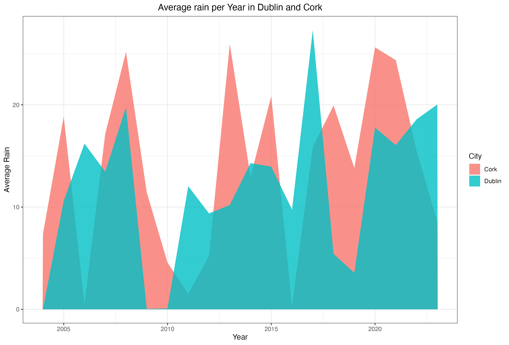
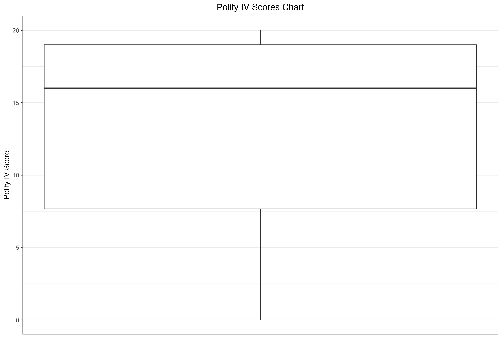

# MATH 9102 - Probability and Statistical Inference Assignment - 1

## 1. Understandig data (3 marks)

### Question A
a. Assume that you have a table with variables that describe a person. 
Name, age, height, weight, and profession. Identify variables that are 
discrete, continuous, and categorical (1 mark).
#### Answer A 
| Variable   | Type        |
|------------|-------------|
| name       | categorical |
| age        | discrete    | 
| height     | continuous  | 
| weight     | continuous  | 
| profession | categorical | 

Student

### Question B
b. Assume that you have a table with variables that describe a lecturer. Name,
gender, subject, semester and staff number. Identify variables that are
ordinal, nominal, interval and ratio. (1 mark)
#### Answer B
| Variable     | Type    |
|--------------|---------|
| name         | nominal |
| gender       | nominal | 
| subject      | nominal | 
| semester     | ordinal | 
| staff number | nominal | 

Lecturer

### Question C
c. You and a friend wonder if it is "normal" that some bottles of your 
favourite beer contain more beer than others although the volume is stated as 
0.33L. You find out from the manufacturer that the volume of beer in a bottle 
has a mean of 0.33L and a standard deviation of 0.03. If you now measure the
beer volume in the next 100 bottles that you drink with your friend, how many
of those 100 bottles are expected to contain more than 0.39L given that the 
information of the manufacturer is correct? (1 mark)
#### Answer C
u = 0.33
x = 0.39
sd = 0.03

z = (x - u)/sd = (0.39 - 0.33) / 0.03 = 2

Normal distribution Table

Z score acummulated value for the value 0.39 = .09772
So bigger than 0.39 is 1 - 0.9772 = 0.0228

In 100 beers we have the probability of 100 * 0.0228 = 2.28 bottles to contain more than 0.39L.

## 2. Descriptive statistics (6 marks)
Use the `salary.rds` dataset from the lecture 1

### Question A
a. Install the following packages `Hmisc`, `pastecs`, `psych`
#### Answer A
```
install.packages('Hmisc')
install.packages('pastecs')
install.packages('psych')
```

### Question B
b. Describe the data using installed packaged and identify the differences 
in description by different package
#### Answer B

#### Hmisc
Input
```
library(Hmisc)
salary<-readRDS("salary.rds")
description <- describe(salary)
print(description)
```
Output
```
salary 

 7  Variables      52  Observations
------------------------------------------------------------------------------------------------------------------------------------
gender 
       n  missing distinct 
      52        0        2 
                        
Value      Female   Male
Frequency      14     38
Proportion  0.269  0.731
------------------------------------------------------------------------------------------------------------------------------------
rank 
       n  missing distinct 
      52        0        3 
                                        
Value      Assistant Associate      Full
Frequency         18        14        20
Proportion     0.346     0.269     0.385
------------------------------------------------------------------------------------------------------------------------------------
yr 
       n  missing distinct     Info     Mean      Gmd      .05      .10      .25      .50      .75      .90      .95 
      52        0       18    0.995    7.481    6.174     0.55     1.00     3.00     7.00    11.00    14.80    16.00 
                                                                                                                      
Value          0     1     2     3     4     5     6     7     8     9    10    11    12    13    15    16    19    25
Frequency      3     4     4     5     4     2     2     3     3     5     3     3     1     4     1     3     1     1
Proportion 0.058 0.077 0.077 0.096 0.077 0.038 0.038 0.058 0.058 0.096 0.058 0.058 0.019 0.077 0.019 0.058 0.019 0.019

For the frequency table, variable is rounded to the nearest 0
------------------------------------------------------------------------------------------------------------------------------------
dg 
       n  missing distinct     Info      Sum     Mean      Gmd 
      52        0        2    0.679       34   0.6538   0.4615 

------------------------------------------------------------------------------------------------------------------------------------
exper 
       n  missing distinct     Info     Mean      Gmd      .05      .10      .25      .50      .75      .90      .95 
      52        0       29    0.998    16.12    11.85     1.00     2.10     6.75    15.50    23.25    30.90    31.45 

lowest :  1  2  3  4  5, highest: 30 31 32 33 35
------------------------------------------------------------------------------------------------------------------------------------
salary 
       n  missing distinct     Info     Mean      Gmd      .05      .10      .25      .50      .75      .90      .95 
      52        0       51        1    23798     6755    16125    16519    18247    23719    27258    31903    34440 

lowest : 15000 15350 16094 16150 16244, highest: 32850 33696 35350 36350 38045
------------------------------------------------------------------------------------------------------------------------------------
expcat 
       n  missing distinct     Info     Mean      Gmd 
      52        0        7    0.972    3.654    2.327 
                                                    
Value          1     2     3     4     5     6     7
Frequency     12     4    10     7     8     5     6
Proportion 0.231 0.077 0.192 0.135 0.154 0.096 0.115

For the frequency table, variable is rounded to the nearest 0
------------------------------------------------------------------------------------------------------------------------------------
> 
```

#### pastecs
Input
```
library(pastecs)
salary<-readRDS("salary.rds")
description <- stat.desc(salary)
print(description)
```
Output
```
         gender rank          yr          dg       exper       salary      expcat
nbr.val      NA   NA  52.0000000 52.00000000  52.0000000 5.200000e+01  52.0000000
nbr.null     NA   NA   3.0000000 18.00000000   0.0000000 0.000000e+00   0.0000000
nbr.na       NA   NA   0.0000000  0.00000000   0.0000000 0.000000e+00   0.0000000
min          NA   NA   0.0000000  0.00000000   1.0000000 1.500000e+04   1.0000000
max          NA   NA  25.0000000  1.00000000  35.0000000 3.804500e+04   7.0000000
range        NA   NA  25.0000000  1.00000000  34.0000000 2.304500e+04   6.0000000
sum          NA   NA 389.0000000 34.00000000 838.0000000 1.237478e+06 190.0000000
median       NA   NA   7.0000000  1.00000000  15.5000000 2.371900e+04   3.5000000
mean         NA   NA   7.4807692  0.65384615  16.1153846 2.379765e+04   3.6538462
SE.mean      NA   NA   0.7637579  0.06661734   1.4175835 8.205804e+02   0.2812446
CI.mean      NA   NA   1.5333079  0.13373989   2.8459176 1.647384e+03   0.5646220
var          NA   NA  30.3329563  0.23076923 104.4962293 3.501431e+07   4.1131222
std.dev      NA   NA   5.5075363  0.48038446  10.2223397 5.917289e+03   2.0280834
coef.var     NA   NA   0.7362259  0.73470565   0.6343218 2.486501e-01   0.5550544
```

#### psych
Input
```
library(psych)
salary<-readRDS("salary.rds")
description <- psych::describe(salary)
print(description)
```
Output
```
        vars  n     mean      sd  median  trimmed     mad   min   max range  skew kurtosis     se
gender*    1 52     1.73    0.45     2.0     1.79    0.00     1     2     1 -1.01    -1.00   0.06
rank*      2 52     2.04    0.86     2.0     2.05    1.48     1     3     2 -0.07    -1.68   0.12
yr         3 52     7.48    5.51     7.0     7.02    5.93     0    25    25  0.75     0.31   0.76
dg         4 52     0.65    0.48     1.0     0.69    0.00     0     1     1 -0.63    -1.64   0.07
exper      5 52    16.12   10.22    15.5    15.95   12.60     1    35    34  0.07    -1.20   1.42
salary     6 52 23797.65 5917.29 23719.0 23389.26 6643.53 15000 38045 23045  0.45    -0.60 820.58
expcat     7 52     3.65    2.03     3.5     3.57    2.22     1     7     6  0.15    -1.23   0.28
```

### Question C
c. Generate summary statistics by using grouping by Gender. (1 mark) 
Hint: *use package psych*
#### Answer C
Input
```
library(psych)
salary<-readRDS("salary.rds")
description_by_gender <- psych::describeBy(salary, group=salary$gender)
print(description_by_gender)
```
Output
```
 Descriptive statistics by group 
group: Female
       vars  n     mean      sd  median  trimmed     mad   min   max range  skew kurtosis      se
gender    1 14     1.00    0.00     1.0     1.00    0.00     1     1     0   NaN      NaN    0.00
rank      2 14     1.71    0.91     1.0     1.67    0.00     1     3     2  0.53    -1.67    0.24
yr        3 14     4.07    3.29     3.5     3.92    3.71     0    10    10  0.30    -1.44    0.88
dg        4 14     0.71    0.47     1.0     0.75    0.00     0     1     1 -0.85    -1.36    0.13
exper     5 14    14.64   12.37    14.5    14.25   18.53     1    33    32  0.22    -1.71    3.31
salary    6 14 21357.14 6151.87 20495.0 20496.25 6044.56 15000 38045 23045  1.26     1.16 1644.16
expcat    7 14     3.43    2.38     3.0     3.33    2.97     1     7     6  0.29    -1.66    0.64
--------------------------------------------------------------------------------------------------- 
group: Male
       vars  n     mean      sd median  trimmed     mad   min   max range  skew kurtosis     se
gender    1 38     2.00    0.00      2     2.00    0.00     2     2     0   NaN      NaN   0.00
rank      2 38     2.16    0.82      2     2.19    1.48     1     3     2 -0.28    -1.51   0.13
yr        3 38     8.74    5.66      9     8.44    5.93     0    25    25  0.55    -0.02   0.92
dg        4 38     0.63    0.49      1     0.66    0.00     0     1     1 -0.52    -1.77   0.08
exper     5 38    16.66    9.44     17    16.59    8.90     1    35    34  0.06    -1.02   1.53
salary    6 38 24696.79 5646.41  24746 24507.62 5682.81 16094 36350 20256  0.19    -0.90 915.97
expcat    7 38     3.74    1.91      4     3.69    1.48     1     7     6  0.10    -1.09   0.31
```

### Question D
d. Identify mean, median, range, 98th percentile of Petal.Length (1 mark)
#### Answer D
Input
```
data(iris)
petalLenght.mean <- mean(iris$Petal.Length)
petalLenght.median <- median(iris$Petal.Length)
petalLenght.range <- range(iris$Petal.Length)
petalLength.98percentile <- quantile(iris$Petal.Length, 0.98)

print(paste('Mean Petal Length:', petalLenght.mean))
print(paste('Median Petal Length:', petalLenght.median))
print(paste('Range Petal Length min:', petalLenght.range[1], ' max:', petalLenght.range[2]))
print(paste('98%  Percentile Petal Length:', petalLength.98percentile))
```
Output
```
[1] "Mean Petal Length: 3.758"
[1] "Median Petal Length: 4.35"
[1] "Range Petal Length min: 1  max: 6.9"
[1] "98%  Percentile Petal Length: 6.602"
```

### Question E
e. Draw the histogram for Septal.Width, mention which measure of 
dispersion method suits the best? (1 mark)
#### Answer E
Input
```
data(iris)
png(file="histogram-sepal-petal.png")
hist(iris$Sepal.Width, main = 'Histogram of Iris Petal With', xlab = 'Iris Petal With')
dev.off()

# Calculate measures of dispersion
sepalWidth.range <- range(iris$Sepal.Width)
sepalWidth.variance <- var(iris$Sepal.Width)
sepalWidth.sd  <- sd(iris$Sepal.Width)
sepalWidth.iqr <- IQR(iris$Petal.Width)

# Print the measures of dispersion
print(paste("Range of Sepal Width: [", sepalWidth.range[1], ',', sepalWidth.range[2], ']'))
print(paste("Variance of Sepal Width:", sepalWidth.variance))
print(paste("Standard Deviation of Sepal Width:", sepalWidth.sd))
print(paste("Interquartile Range of Sepal Width:", sepalWidth.iqr))
```

Output


```
[1] "Range of Sepal Width: [ 2 , 4.4 ]"
[1] "Variance of Sepal Width: 0.189979418344519"
[1] "Standard Deviation of Sepal Width: 0.435866284936698"
[1] "Interquartile Range of Sepal Width: 1.5"
```

The histogram reveals a bell-shaped curve reminiscent of the normal 
distribution. Given the data's normal distribution with a continuous 
variable, it's advisable to utilize the mean and standard deviation. 
Opting for the standard deviation over the variance is preferable since 
it preserves the units of the variable and facilitates easier comprehension.

### Question F
Load *HairEyeColor* dataset into workspace.
*Hint: dataHairEye <- as.data.frame(HairEyeColor)*

f. As a cutomer, I would like to know the total number of people with various
color combination of hair and eyes. Which chart suits best for this task? 
Plot the same. (1 mark)
#### Answer F

For this dataset we are counting the value of *two categorical* variables so 
we need to find a way to see this two variables and how they correlate with 
other.

Initially, I considered a *heatmap* or a chart 
*count overlapping points*. However, I encountered difficulties in 
thoroughly examining the data.


As you can observe, distinguishing between the values of "Brown Hair - Blue Eye"
and "Black Hair - Brown Eye" isn't straightforward.

Therefore, I opted for a bar plot. In this plot, hair color is 
represented on the *x-axis*, with each bar representing a different 
*eye color category value* plotted side by side on the *y-axis*.


So I think that the bar-plot chart is the best representation for this data.

The input for this exercise is presented below
```
data(HairEyeColor)
dataHairEye <- as.data.frame(HairEyeColor)

ggplot(data = dataHairEye, aes(x = Hair, y=Eye, weight = Freq)) + 
geom_count() + ggtitle("Hair and Eye Color Total") + 
theme_bw() + 
theme(plot.title = element_text(hjust = 0.5)) 

ggsave('hair-eye-two-variables.png')

ggplot(data = dataHairEye, aes(x = Hair, weight = Freq)) + 
geom_bar(aes(fill = Eye), position = 'dodge') + 
ggtitle("Hair and Eye Color Total") + 
ylab("Number of People") + 
theme(plot.title = element_text(hjust = 0.5))

ggsave('hair-eye-bar-plot.png') 
```

## 3. Visualization (6 marks)

### Question A
a. A meteorologist wants to compare the annual average rain fall 
between two cities for the past 20 years. Which plot is most suitable?
Plot the graph by generating 20 random data points between 0 and 28 for Dublin
and Cork. (2 marks)
#### Answer A 

For a dataset comprising 20 data points and aiming to compare two cities, 
I think that an area chart is the best one. 
Employing a bar plot in this context could potentially lead to confusion
due to the multitude of bars per year and per city. 
Therefore, opting for an area chart would be more advantageous
for comparing the categories of Dublin and Cork and visualizing their
changes over time.



Input to generate the previous plot
```
install.packages("tidyr")

library(tidyr)
library(plotly)

current_year <- as.numeric(format(Sys.Date(), "%Y"))

rain_data <- data.frame(Year = (current_year - 20):(current_year - 1), Cork = runif(20, 0, 28), Dublin = runif(20, 0, 28))

df_rain_data <- gather(rain_data, City, Rain, c(Dublin,Cork))

ggplot(data=df_rain_data, aes(x = Year, fill = City)) + 
  geom_area(aes(y = Rain), position = position_dodge(width = 0), alpha=0.8) +
  ylab("Average Rain") + 
  ggtitle("Average rain per Year in Dublin and Cork") +
  theme_bw() +
  theme(plot.title = element_text(hjust = 0.5)) 

ggsave('dublin-cork-rain.png') 
```

### Question B
b. Load the provided `world-small.csv` file. (2 marks)
    
- i. Draw histogram for 'gdppcap08'
- ii. Draw boxplot for 'polityIV'
- iii. Identify the region that has highest gdpcap.
- iv. Which country has lowest polityIV?

#### Answer B 

##### i.
Input
```
df_world_small <- read.csv("world-small.csv", header = TRUE)

ggplot(df_world_small, aes(x = gdppcap08)) +
geom_histogram(binwidth = 1000) +
labs(title = "GDP per Capita in 2008", x = "GDP per Capita", y = "Frequency") +
theme_bw() +
theme(plot.title = element_text(hjust = 0.5))

ggsave('gdppcap08.png') 
```
Output


##### ii.
Input
```
ggplot(df_world_small, aes(y = polityIV)) +
  geom_boxplot() +
  labs(title = "Polity IV Scores Chart", x = "", y = "Polity IV Score") +
  theme_bw() +
  theme(plot.title = element_text(hjust = 0.5),
    axis.title.x=element_blank(),
    axis.text.x=element_blank(),
    axis.ticks.x=element_blank(),
    panel.grid.major.x = element_blank(),
    panel.grid.minor.x = element_blank())
ggsave('polityiv.png')

ggplot(df_world_small, aes(y = polityIV, x = region)) +
  geom_boxplot() +
  labs(title = "Polity IV Per Region Scores Chart", x = "Region", y = "Polity IV Score") +
  theme_bw() +
  theme(plot.title = element_text(hjust = 0.5),
    axis.text.x = element_text(angle = 90, vjust = 0.5, hjust=1))
ggsave('polityiv-per-region.png') 
```

Output



##### iii.
iii. Identify the region that has highest gdpcap. 

##### iv.
iv. Which country has lowest polityIV ?

### Question C
c. Table 1 represents people in Dublin who like to own 
certain types of pets. (2 marks)

Table 1: Pet Lovers

| Pet | Number of people |
|------|------------------|
| Dogs | 2034             |
| Cats | 492              |
| Fish | 785              |
| Macaw| 298              |

- i. Plot the most suitable graph for the given dataset.
- ii. Is it a good idea to choose a pie chart (in case 
 you have not chosen it in (i))? Why is it a good idea or why is it not a good idea?

#### Answer C 

##### i.


##### ii.

i. The most suitable graph for the given dataset is a bar graph. A bar graph allows for easy comparison of the number of people who like each type of pet.

ii. No, it is not a good idea to choose a pie chart for this dataset. Pie charts are typically used to represent parts of a whole, where each part represents a proportion of the entire dataset. In this case, the number of people who like each type of pet is not directly proportional to the whole dataset, making a pie chart less suitable. Additionally, comparing the absolute values of the number of people who like each type of pet is more intuitive with a bar graph than with a pie chart.
