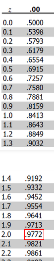
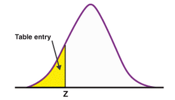

```{r, echo = TRUE, results = "hide"}
if ('knitr' %in% installed.packages() == FALSE) {
  install.packages('knitr', repos = 'http://cran.us.r-project.org')
}

library(knitr)
```

# 1. Understanding data (3 marks)

## Question a

Assume that you have a table with variables that describe a person, Name, age,
height, weight and profession. Identify variables that are discrete, 
continuous, and categorical. (1 mark)

### Answer

Person 

| Variable   | Type        |
|------------|-------------|
| name       | categorical |
| age        | discrete    | 
| height     | continuous  | 
| weight     | continuous  | 
| profession | categorical | 

## Question b

Assume that you have a table with variables that describe a lecturer. Name,
gender, subject, semester, and semester, and staff number. Identify variables
that are ordinal, interval, and ratio. (1 mark)

### Answer

Lecturer

| Variable     | Type    |
|--------------|---------|
| name         | nominal |
| gender       | nominal | 
| subject      | nominal | 
| semester     | ordinal | 
| staff number | nominal | 

## Question c

You and a friend wonder if it is "normal" that some bottles of your 
favourite beer contain more beer than others although the volume is stated as 
0.33L. You find out from the manufacturer that the volume of beer in a bottle 
has a mean of 0.33L and a standard deviation of 0.03. If you now measure the
beer volume in the next 100 bottles that you drink with your friend, how many
of those 100 bottles are expected to contain more than 0.39L given that the 
information of the manufacturer is correct? (1 mark)

### Answer
To solve this problem we can use the central limit theorem that states 
that if we take a sufficiently large samples of a population, the samples
means will be normally distributed even if the population isn't normally
distributed.

So we have the given parameters: 
$$x = 0.39L\ \mbox{individual value}$$
$$\mu = 0.33L\ \mbox{mean}$$
$$\sigma = 0.03L \ \mbox{Standard deviation}$$

Now we need to calculate the $z$ score for a normal distribution.

$$ z = \frac{x - \mu}{\sigma}$$
Using the previous values:
$$ z = \frac{0.39 - 0.33}{0.03} = \frac{0.06}{0.03} = 2$$
Now that we have the $z$ score the next step is to find the probability 
for this value in the $z$ score table for normal probabilities.



For $z = 2$ we have the probability of $0.9772$
This means that the *probability of getting a coke can 0.39L* is  $0.9772$



$$\mathcal{P}(X = 0.39) = 0.9772$$
So to calculate $\mathcal{P}(X > 0.39)$ and because we are talking a 
continuous variable we can say: 
$$\mathcal{P}(X > 0.39) = 1 - \mathcal{P}(X = 0.39)$$ 
$$\mathcal{P}(X > 0.39) = 1 - 0.9772 = 0.0228$$ 
So for the next 100 bottles we have the probability of find
$(100 * 0.0228) = 2.28$ bottles with more than 0.39L.

# 2. Descriptive statistics (6 marks)
Use the `salary.rds` dataset from the lecture 1

## Question a
Install the following packages `Hmisc`, `pastecs`, `psych`

### Answer

```{r, echo = TRUE, results = "hide"}
if ('Hmisc' %in% installed.packages() == FALSE) {
  install.packages('Hmisc', repos = 'http://cran.us.r-project.org')
}

if ('pastecs' %in% installed.packages() == FALSE) {
  install.packages('pastecs', repos = 'http://cran.us.r-project.org')
}

if ('psych' %in% installed.packages() == FALSE) {
install.packages('psych', repos = 'http://cran.us.r-project.org')
}
```

## Question b
Describe the data using installed packaged and identify the differences 
in description by different package

### Answer

Hmisc 
: `describe` shows a summary of the data showing the *standard variation*, 
*median*, *quartiles* *highest* and *lowers* presenting the data as a 
frequency table per variable. It also shows presents a histogram if the 
variable is numeric.

pastecs
: `pastec.stat` shows a table with descriptive statistics *only for numerical 
variables*. It presents various dispersed variables like *mean*, *median*, *variance*,
*stardand variation*, *range*, *min*, *max*, It shows the *Standard Error Mean*,
and the *Confidence Interfal of the Mean*.

psych
: `describe` shows a table with the *number of sample* (discards the null values),
*mean*, *median*, *trimmed mean*, *min* value, *max* value, *range*, 
*standard deviation*, *standand error*, it is less data than the `pastecs` 
package but shows the *skew* and *kurtosis* of the variables. Variables that
are categorical or logical are converted to numerical and marked with a `*`


```{r, echo = TRUE, results = "markup"}

library(Hmisc, warn.conflicts = FALSE)
library(pastecs, warn.conflicts = FALSE)
library(psych, warn.conflicts = FALSE)

salary<-readRDS("data/salary.rds")

description.Hmisc <- Hmisc::describe(salary)
description.pastecs <- pastecs::stat.desc(salary)
description.psych <- psych::describe(salary)

html(description.Hmisc)
kable(description.pastecs)
kable(description.psych)
```

## Question c
Generate summary statistics by using grouping by Gender. (1 mark) 

Hint: *use package psych*

### Answer

```{r, echo = TRUE,results='asis'}
description.psych.by_gender <- psych::describeBy(salary, group=salary$gender)
render.description.psych.by_gender <- lapply(names(description.psych.by_gender), 
                                             function(name){
                                               knitr::kable(description.psych.by_gender[name], caption = name)})
render.description.psych.by_gender
```

## Question d
Load *iris* dataset into workspace.

Identify mean, median, range, 98th percentile of Petal.Length (1 mark)

### Answer 

```{r, echo = TRUE,results='markdown'}
petalLenght.mean <- mean(iris$Petal.Length)
petalLenght.median <- median(iris$Petal.Length)
petalLenght.range <- range(iris$Petal.Length)
petalLength.98percentile <- quantile(iris$Petal.Length, 0.98)

print(paste('Mean Petal Length:', petalLenght.mean))
print(paste('Median Petal Length:', petalLenght.median))
print(paste('Range Petal Length min:', petalLenght.range[1], ' max:', petalLenght.range[2]))
print(paste('98%  Percentile Petal Length:', petalLength.98percentile))
```

## Question e

Draw the histogram for Sepal.Width, mention which measure of 
dispersion method suits the best? (1 mark)

### Answer 

The histogram reveals a bell-shaped curve reminiscent of the normal 
distribution. Given the data's normal distribution with a continuous 
variable, it's advisable to utilize the mean and standard deviation. 
Opting for the standard deviation over the variance is preferable since 
it preserves the units of the variable and facilitates easier comprehension.

```{r iris-sepal-with-plot, dev='png'}
hist(iris$Sepal.Width, main = 'Histogram of Iris Petal With', xlab = 'Iris Sepal With')
```

```{r, echo = TRUE,results='markdown'}
sepalWidth.range <- range(iris$Sepal.Width)
sepalWidth.variance <- var(iris$Sepal.Width)
sepalWidth.sd  <- sd(iris$Sepal.Width)
sepalWidth.iqr <- IQR(iris$Petal.Width)

# Print the measures of dispersion
print(paste("Range of Sepal Width: [", sepalWidth.range[1], ',', sepalWidth.range[2], ']'))
print(paste("Variance of Sepal Width:", sepalWidth.variance))
print(paste("Standard Deviation of Sepal Width:", sepalWidth.sd))
print(paste("Interquartile Range of Sepal Width:", sepalWidth.iqr))
```

## Question f
Load *HairEyeColor* dataset into workspace.

*Hint: dataHairEye <- as.data.frame(HairEyeColor)*

As a customer, I would like to know the total number of people with various
color combination of hair and eyes. Which chart suits best for this task? 
Plot the same. (1 mark)

### Answer 
For this dataset we are counting the value of *two categorical* variables, so 
we need to find a way to see this two variables and how they correlate each other.

Initially, I considered a *heatmap* or a chart 
*count overlapping points*. However, I encountered difficulties in 
thoroughly examining the data.

```{r hair-eye-two-var-plot, dev='png'}
if ('ggplot2' %in% installed.packages() == FALSE) {
  install.packages('ggplot2', repos = 'http://cran.us.r-project.org')
}

library(ggplot2, warn.conflicts = FALSE)

data(HairEyeColor)
dataHairEye <- as.data.frame(HairEyeColor)

ggplot(data = dataHairEye, aes(x = Hair, y=Eye, weight = Freq)) + 
geom_count() + ggtitle("Hair and Eye Color Total") + 
theme_bw() + 
theme(plot.title = element_text(hjust = 0.5)) 
```

As you can observe, distinguishing between the values of "Brown Hair - Blue Eye"
and "Black Hair - Brown Eye" isn't straightforward.

Therefore, I opted for a bar plot. In this plot, hair color is 
represented on the *x-axis*, with each bar representing a different 
*eye color category value* plotted side by side on the *y-axis*.

```{r hair-eye-plot, dev='png'}
ggplot(data = dataHairEye, aes(x = Hair, weight = Freq)) + 
geom_bar(aes(fill = Eye), position = 'dodge') + 
ggtitle("Hair and Eye Color Total") + 
ylab("Number of People") + 
theme(plot.title = element_text(hjust = 0.5))
```

So I think that the bar-plot chart is the best representation for this data.

# 3. Visualization (6 marks)

## Question a
A meteorologist wants to compare the annual average rain fall 
between two cities for the past 20 years. Which plot is most suitable?
Plot the graph by generating 20 random data points between 0 and 28 for Dublin
and Cork. (2 marks)

### Answer 

For a dataset comprising 20 data points and aiming to compare two cities, 
I think that an area chart is the best one. 

Employing a bar plot in this context could potentially lead to confusion
due to the multitude of bars per year and per city. 

Therefore, opting for an area chart would be more advantageous
for comparing the categories of Dublin and Cork and visualizing their
changes over time.

```{r dublin-cork-rain-plot, dev='png'}
 if ('tidyr' %in% installed.packages() == FALSE) {
     install.packages('tidyr', repos = 'http://cran.us.r-project.org')
 }
library(tidyr, warn.conflicts = FALSE)

current_year <- as.numeric(format(Sys.Date(), "%Y"))
rain_data <- data.frame(Year = (current_year - 20):(current_year - 1), 
                        Cork = runif(20, 0, 28), 
                        Dublin = runif(20, 0, 28))
df_rain_data <- gather(rain_data, City, Rain, c(Dublin,Cork))

ggplot(data=df_rain_data, aes(x = Year, fill = City)) + 
  geom_area(aes(y = Rain), position = position_dodge(width = 0), alpha=0.8) +
  ylab("Average Rain") + 
  ggtitle("Average rain per Year in Dublin and Cork") +
  theme_bw() +
  theme(plot.title = element_text(hjust = 0.5)) 
```

## Question b
Load the provided `world-small.csv` file. (2 marks)
    
- i. Draw histogram for 'gdppcap08'
- ii. Draw boxplot for 'polityIV'
- iii. Identify the region that has highest gdpcap.
- iv. Which country has lowest polityIV?

### Answer 

#### i

```{r gdppcap08-plot, dev='png'}
df_world_small <- read.csv("data/world-small.csv", header = TRUE)

ggplot(df_world_small, aes(x = gdppcap08)) +
geom_histogram(binwidth = 1000) +
labs(title = "GDP per Capita in 2008", x = "GDP per Capita", y = "Frequency") +
theme_bw() +
theme(plot.title = element_text(hjust = 0.5))
```

#### ii

```{r politiv-plot, dev='png'}
ggplot(df_world_small, aes(y = polityIV)) +
  geom_boxplot() +
  labs(title = "Polity IV Scores Chart", x = "", y = "Polity IV Score") +
  theme_bw() +
  theme(plot.title = element_text(hjust = 0.5),
    axis.title.x=element_blank(),
    axis.text.x=element_blank(),
    axis.ticks.x=element_blank(),
    panel.grid.major.x = element_blank(),
    panel.grid.minor.x = element_blank())
```

```{r politiv-per-region-plot, dev='png'}
ggplot(df_world_small, aes(y = polityIV, x = region)) +
  geom_boxplot() +
  labs(title = "Polity IV Per Region Scores Chart", x = "Region", y = "Polity IV Score") +
  theme_bw() +
  theme(plot.title = element_text(hjust = 0.5),
    axis.text.x = element_text(angle = 90, vjust = 0.5, hjust=1))
```

#### iii

To find the region with the biggest GDP per Capita we need to do the following
- 1. we need to find the maximum value and the corresponding index `which.max(df_world_small$gdppcap08)`
- 2. select the row `df_world_small[which.max(df_world_small$gdppcap08), ]`
- 3. filter the column region `df_world_small[which.max(df_world_small$gdppcap08), "region"]`

```{r, echo = TRUE,results='markdown'}
region_biggest_gdpcap08 <- df_world_small[which.max(df_world_small$gdppcap08), "region"]
print(region_biggest_gdpcap08)
```

#### iv

To find the country with the lowest polityIV Index we need to do the following steps:

- 1. we need to find the minimum polityIV value and the corresponding index `which.min(df_world_small$polityIV)`
- 2. select the row `df_world_small[which.min(df_world_small$polityIV), ]`
- 3. filter the column country `df_world_small[which.min(df_world_small$polityIV), "country"]`

To find *all* the countries with the lowest polityIV Index we need to do the following steps:

- 1. we need to find the minimum polityIV value `min(df_world_small$polityIV)`
- 2. filter all the values corresponding to the value `df_world_small$polityIV == min(df_world_small$polityIV)`
- 3. select the corresponding rows `df_world_small[df_world_small$polityIV == min(df_world_small$polityIV), ]`
- 4. filter the column country `df_world_small[df_world_small$polityIV == min(df_world_small$polityIV), "country"]`

```{r, echo = TRUE,results='markdown'}
country_with_min_polityiv <- df_world_small[which.min(df_world_small$polityIV), "country"]
countries_with_min_polityiv <- df_world_small[df_world_small$polityIV == min(df_world_small$polityIV), "country"]

print(country_with_min_polityiv)
print(countries_with_min_polityiv)
```


## Question c
Table 1 represents people in Dublin who like to own 
certain types of pets. (2 marks)

Table 1: Pet Lovers

| Pet | Number of people |
|------|------------------|
| Dogs | 2034             |
| Cats | 492              |
| Fish | 785              |
| Macaw| 298              |

- i. Plot the most suitable graph for the given dataset.
- ii. Is it a good idea to choose a pie chart (in case 
 you have not chosen it in (i))? Why is it a good idea or why 
 is it not a good idea?

### Answer 

#### i
```{r pets-bar-plot, dev='png'}
pets_text <- "Pet Number_of_people
              Dogs	2034
              Cats	492
              Fish	785
              Macaw	298"

df_pets <- read.table(text = pets_text, header = TRUE)

ggplot(data = df_pets, aes(x = Pet, y = Number_of_people)) + 
   geom_bar(stat = "identity") +
   labs(title = "Pet Lovers Bar Chart", x = "Pet", y = "Number of People") +
   theme_bw() +
   theme(plot.title = element_text(hjust = 0.5))
```

#### ii

Looking at the pie chart of pets, I find it challenging to 
discern and compare the number of individuals who favor each type
of pet. In my opinion, a pie chart is more effective for 
representing proportions rather than absolute values.

```{r pets-pie-plot, dev='png'}
ggplot(data = df_pets, aes(x ="" , y = Number_of_people, fill = Pet)) +
  geom_bar(stat = "identity", width = 1) +
  coord_polar("y", start=0) +
  labs(title = "Pet Lovers Pie Chart") +
  theme_bw() + 
  theme_void() +
  theme(plot.title = element_text(hjust = 0.5))
```
